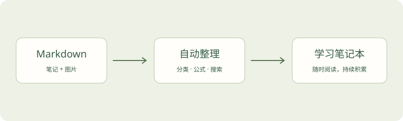

# 开始写笔记

这里是你的个人学习笔记本。把知识写下来，也给下一次思考留一个入口。

## 文件夹就是分类

把 Markdown 和图片放进 `notes/`，不需要添加日期、标签或配置文件。

```text
notes/
  数值分析/
    Jacobi Method.md
    images/
      iteration.png
  机器学习/
    线性回归.md
```

子文件夹名称会自动变成分类。更深一层的文件夹也可以，例如 `数学/线性代数`。标题默认取第一个一级标题，没有标题时使用文件名。

## 图片跟着笔记走

使用 Markdown 相对路径：``。请把图片文件也一起提交，网站会自动处理中文和空格路径。



如果原笔记使用 `C:/...` 或 `file:///...` 的图片路径，先用仓库中的导入工具转存图片。直接上传 Markdown 无法让网站访问你电脑上的文件。

## 数学公式

行内公式用单个美元符号，例如 $Ax=b$、$e^{i\pi}+1=0$。

独立公式用两个美元符号包围：

$$
x^{(k+1)} = D^{-1}\left(b-Rx^{(k)}\right)
$$

```latex
$$
\sum_{i=1}^{n} i = \frac{n(n+1)}{2}
$$
```

矩阵、分式与多行推导也可以：

$$
\begin{aligned}
A &= \begin{bmatrix}4 & 1 \\ 2 & 3\end{bmatrix} \\
x^{(k+1)} &= D^{-1}(b-Rx^{(k)})
\end{aligned}
$$

## 连接知识

可以用相对路径链接另一篇笔记：[阅读 Jacobi Method](../数值分析/Jacobi%20Method.md)。笔记中的标题会自动生成右侧目录。

## 保持简单

首页支持分类筛选和全文搜索，右上角可以切换深色模式。先把最值得记录的一点写下来，知识库就会慢慢生长。
